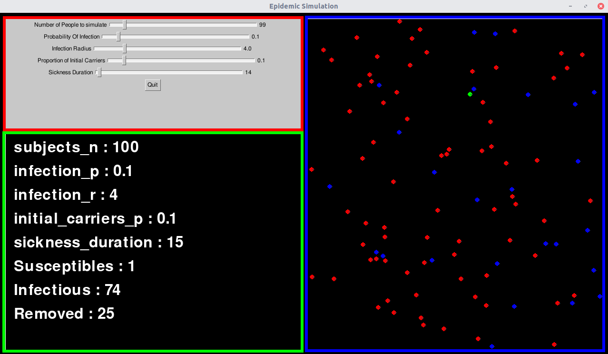
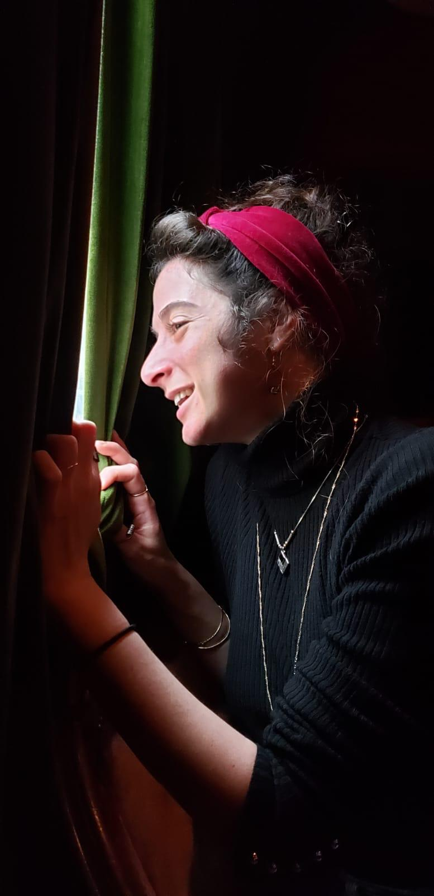

<a href="https://il.usembassy.gov/slide/covid-19-information/"></a>

<!-- [](https://il.usembassy.gov/slide/covid-19-information/) -->

# Epidemic Simulation

> Python for neuroscientists hackathon project

**GUI**


---

## Table of Contents

- [Installation](#installation)
- [Features](#features)
- [Contributing](#contributing)
- [Team](#team)
- [Support](#support)
- [License](#license)

## Installation

> Only repository cloning is currently available in order to make use of this project:

```
git clone https://github.com/Hershkovitz-hub/EpidemicSimulation
cd EpidemicSimulation
```

### Clone

- Clone this repo to your local machine using `https://github.com/Hershkovitz-hub/EpidemicSimulation`

### Setup

> First, install project's requirements:

```python
pip install -r requirements.txt
```

> Then, install project as editable python package:

```
pip install -e .
```

## Features


The simulation offers 3 main features/windows:

- User interface window (top left, red), where users can define simulation's parameters, such as:
  - Number of people to simulate.
  - Probability of infection upon being close to an infectious subject
  - Infectious radius, which determines how far can an infectious subject infect susceptible ones.
  - Proportion of initial carriers (in relevance to number of simulated subjects)
  - Sickness duration, i.e how long does a subject remain infectious before his status is changed to "removed"
- Parameter presentation window (bottom left, blue), which presents user's selections, and in addition subject's population in the manner of it's division into the three SIR group: Susceptible, Infectios and Removed.
- Simulation's visualisation window (right, blue), which offers a visualisation of the current simulation, where:
  - Green subjects are susceptible
  - Red subjects are infectious
  - Blue subjects are Removed

## Usage

To initiate the GUI, open the terminal at repo's location:

```
cd EpidemicSimulation
```

and simply type:

```
python play_with_sick_people.py
```

## Tests

> All simulation-related calculations are tested and stable. GUI-related features, however, still need work.

## Contributing

> To get started...

### Step 1

- **Option 1**

  - 🍴 Fork this repo!

- **Option 2**
  - 👯 Clone this repo to your local machine using `https://github.com/Hershkovitz-hub/EpidemicSimulation`

### Step 2

- **HACK AWAY!** 🔨🔨🔨

### Step 3

- 🔃 Create a new pull request using <a href="https://github.com/Hershkovitz-hub/EpidemicSimulation/compare/" target="_blank">`https://github.com/Hershkovitz-hub/EpidemicSimulation/compare/`</a>.

---

## Team

> Or Contributors/People

|                                       <a href="https://github.com/Hershkovitz-hub" target="_blank">**Gal Hershkovitz**</a>                                       |         <a href="https://github.com/nogayair" target="_blank">**Noga Yair**</a>         |         <a href="https://github.com/Tal-Camchy" target="_blank">**Tal Camchy**</a>          |
| :--------------------------------------------------------------------------------------------------------------------------------------------------------------: | :-------------------------------------------------------------------------------------: | :-----------------------------------------------------------------------------------------: |
| [](https://github.com/Hershkovitz-hub) |           [](https://github.com/nogayair)            |            [](https://github.com/Tal-Camchy)            |
|                              <a href="https://github.com/Hershkovitz-hub" target="_blank">`https://github.com/Hershkovitz-hub`</a>                               | <a href="https://github.com/nogayair" target="_blank">`https://github.com/nogayair`</a> | <a href="https://github.com/Tal-Camchy" target="_blank">`https://github.com/Tal-Camchy`</a> |

## Support

Reach out to us at one of the following places!

- Websites at:
  - <a href="https://github.com/Hershkovitz-hub" target="_blank">`https://github.com/Hershkovitz-hub`</a>
  - <a href="https://github.com/nogayair" target="_blank">`https://github.com/nogayair`</a>
  - <a href="https://github.com/Tal-Camchy" target="_blank">`https://github.com/Tal-Camchy`</a>
- Twitter at <a href="https://twitter.com/GalHershkovitz" target="_blank">`@GalHershkovitz`</a>
- Emails at:
  - <hershkovitz1@mail.tau.ac.il>
  - <Talcamchy@gmail.com>
  - <nogayair@mail.tau.ac.i>

---

## License

[](http://badges.mit-license.org)

- **[MIT license](LICENSE)**
